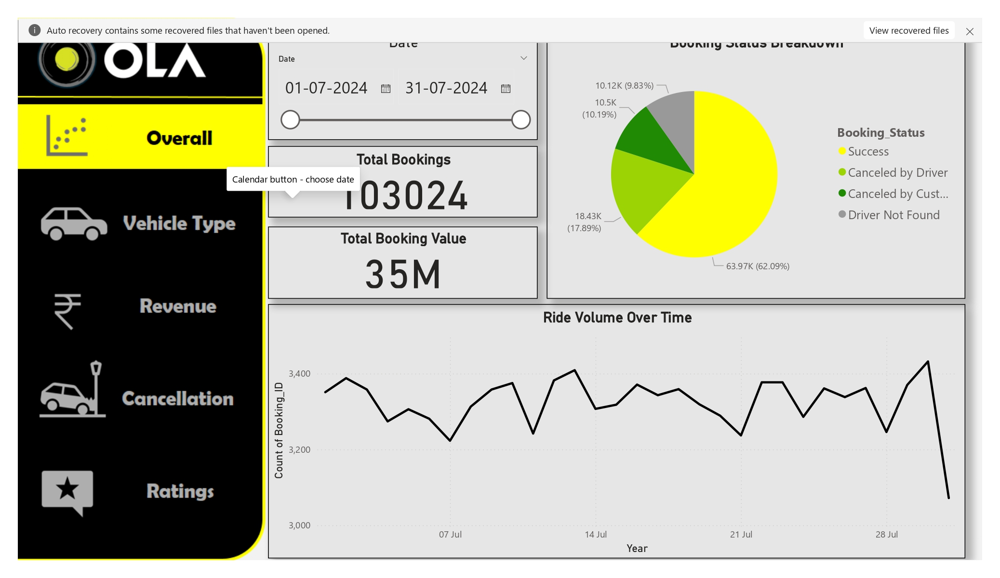
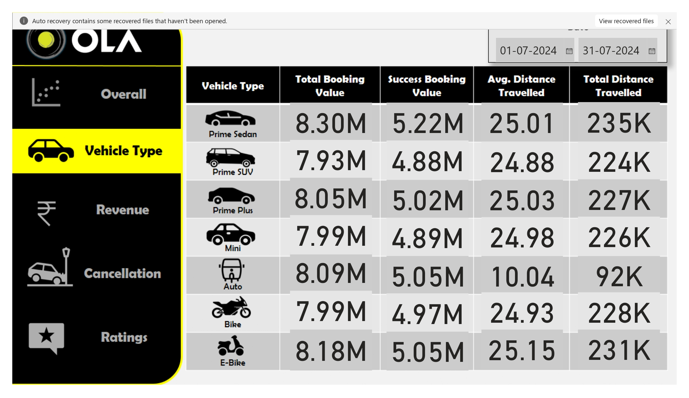
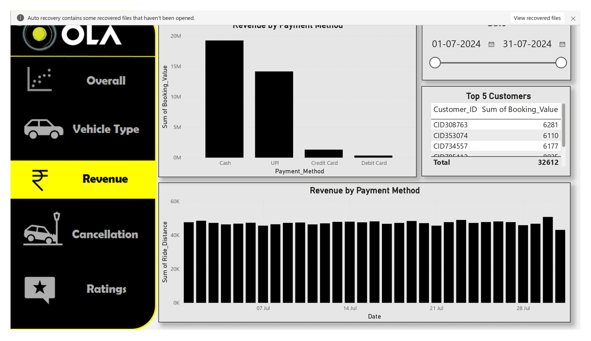
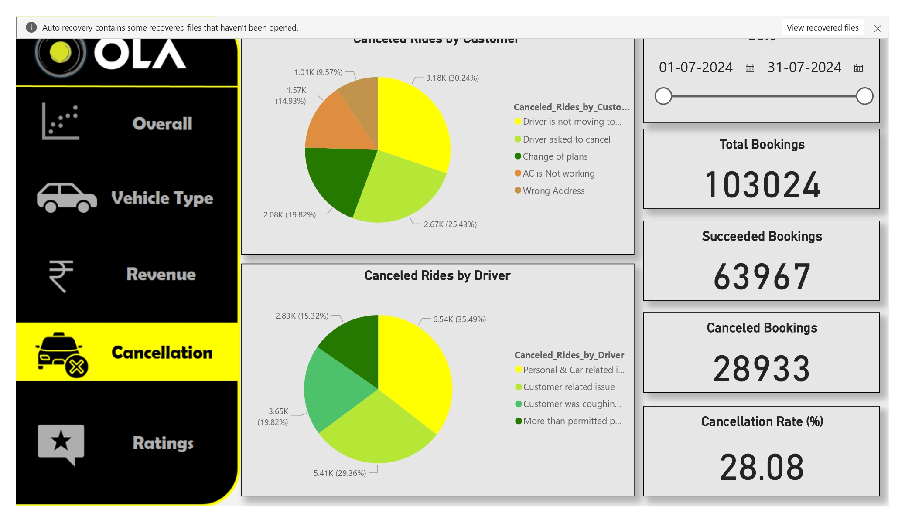
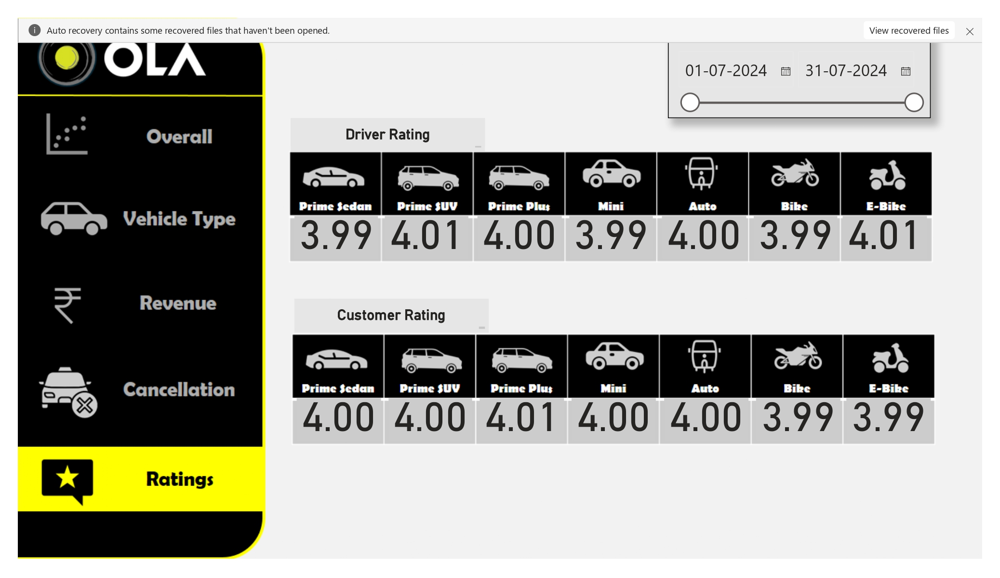

# 🚖 Ola Ride Data Analysis using SQL Server & Power BI

This project analyzes over 100,000 Ola ride records to uncover key business insights using SQL Server for data analysis and Power BI for data visualization.

## 🔍 Project Objectives

- Analyze booking behaviors, ride cancellations, and customer feedback.
- Evaluate vehicle performance and payment method preferences.
- Visualize key performance indicators (KPIs) through interactive dashboards.

## 🧠 Key KPIs Analyzed

- ✅ Successful Bookings
- ❌ Canceled Rides by Customers vs. Drivers
- 🚗 Average Ride Distance per Vehicle Type
- 💰 Total Booking Value of Successful Rides
- 🌟 Customer & Driver Ratings Distribution
- 📱 Payment Method Trends

## 📊 Power BI Dashboards

### 1. Ride Volume Over Time and Booking Status Breakdown

### 2. Top Vehicle Types by Ride Distance

### 3. Revenue by Payment Method

### 4. Reasons for Ride Cancellations by Customers or Drivers

### 5. Customer and Driver Ratings

## 🧾 SQL Queries Used

All SQL views and queries utilized in this project are available in the [`SQL_Queries`](./SQL_Queries/ola_analysis_queries.sql) directory.

## 📁 Dataset

The dataset is a simulated representation of Ola ride data, designed for analytical practice. For more details, refer to [`Dataset_Info.md`](./Dataset_Info.md).

## 📌 Tools & Technologies

- SQL Server
- Power BI
- Git & GitHub

## 📈 Insights Summary

For a comprehensive overview of the findings and visualizations, see [`Insights_Summary.pdf`](./Insights_Summary.pdf).
